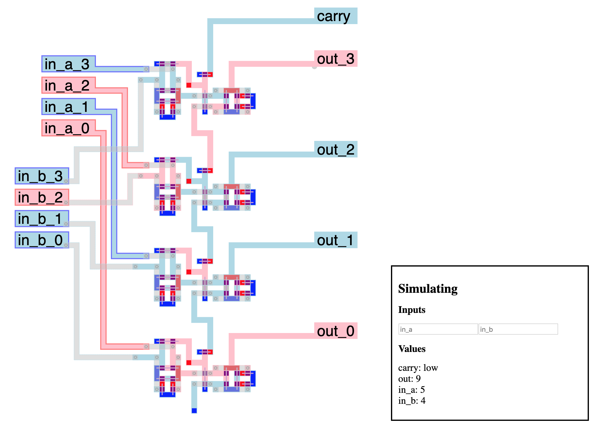
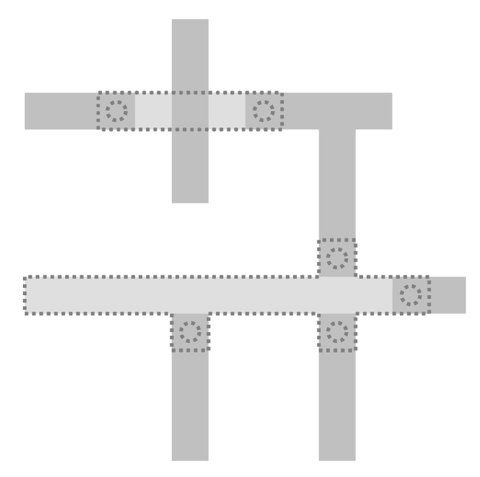
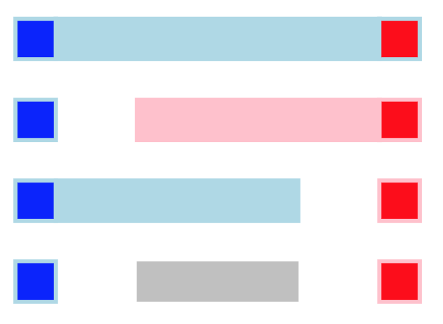
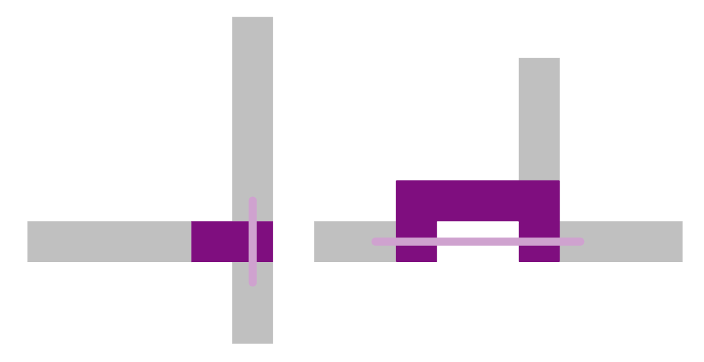
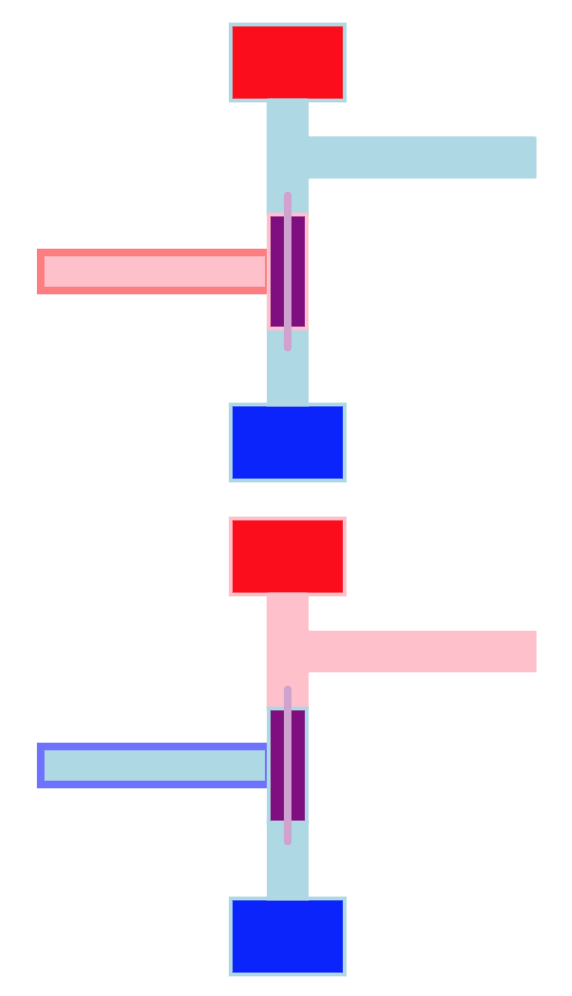
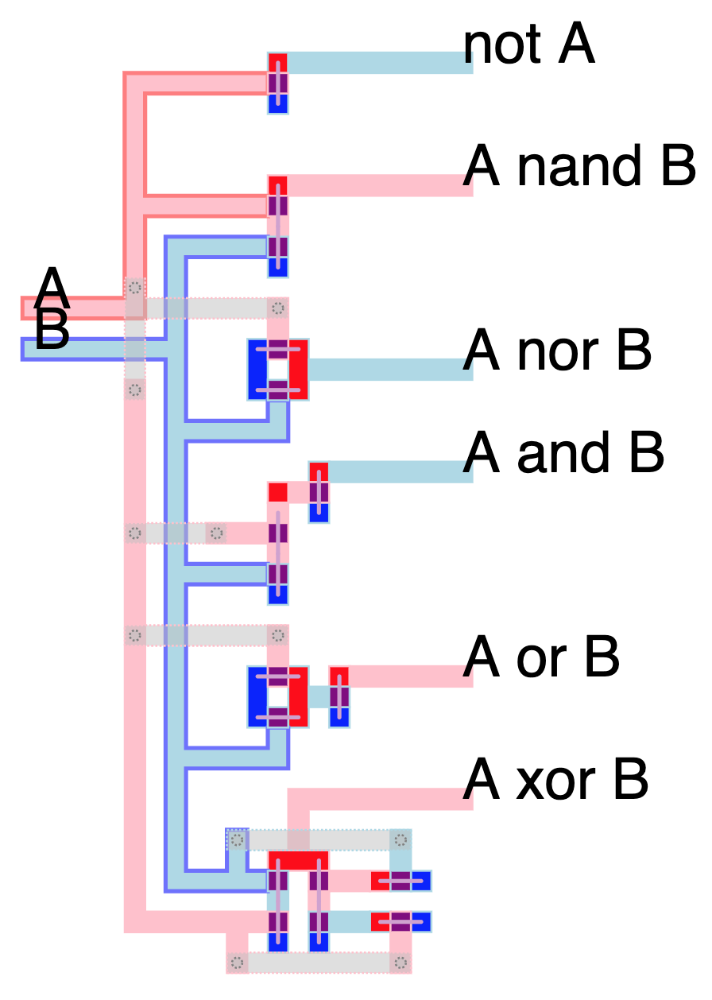

# MiPSim

*A transistor-level microprocessor simulator and editor*

See it [live](https://castux.github.io/mipsim/)!

## Motivation

The [Visual6502](http://www.visual6502.org/) project shows that early microprocessors were actually fairly simple. By taking hi-res pictures of the different layers of the 6502, tracing the shape of the metal and semiconductor tracks, checking connections, and adding simple logic, they were able to simulate a fully working microprocessor.

This seemed too good to be true. So I made my own.

This simulator abstracts reality a bit more than the Visual6502 project, but not by that much. All you get is wires, power, ground and transistors which reproduce the behavior of n-channel enhancement-mode [MOSFET transistors](https://en.wikipedia.org/wiki/MOSFET). That is, a positive voltage at the gate forms a conductive channel between the source and drain of the transistor, allowing current to pass and electric potential to equalize.

As it turns out, this is enough to create logic gates and memory cells, which is enough to build a microprocessor.

This simulator (like Visual6502), operates at a logic level, and abstracts away actual current, voltages, propagation times, etc., which real microprocessor design takes in account, but this is enough to make a nice didactic toy.

## Simulator

### Components

The simulator is based on tiles on a grid:

- wires
- power sources
- connections to ground
- transistors
- bridges, which are just wires on a second layer for easier wire crossing. They connect only to wires, and only at "endpoints" (bridge tiles that have only one neighbor). Endpoints are marked with circles in the editor:

All connected tiles of a single type are considered to be a single *component*. All components with adjacent tiles are considered *connected* to each other (as well as bridges and wires at endpoints).

### Wire states

Wires can be in several states:

- floating, if there are connected to neither ground nor power (grey)
- high, if they are connected to a power source (red)
- low, if they are connected to ground (blue)

When connected to both ground and power, wires are low (power tiles actually represent power sources protected with a resistor, to prevents shorts).

### Transistors

Transistors must have exactly three components connected to them: the gate (which controls if the transistor is passing or not), and the two others (drain and source), which in this simulation are interchangeable.

The simulator pairs any two components that touch the transistor as the drain and source if they are axis aligned (vertically or horizontally), and the third one as the gate. If more than one pair satisfies this condition, they are picked randomly. A line indicates the drain and source:

During simulation, if the wire at the gate is high, the transistor is passing, and drain and source are connected. If the gate wire is in any other state, the transistor is not passing and gate and source are separate.

### Logic gates

These simple rules allow building logic gates. The simplest one is the inverter, ie. the boolean `not`:

When the input (left) is low, the transistor is not passing, and the output is only connected to the power source, making it high. When the input is high, the transistor is passing, and the output is connected to both the power source and the ground, making it low.

Similar concepts are used to build all common logical gates:

And combining them to form higher level circuits.

## Editor

The editor runs in browser and allows you to load, edit, and save circuits/patterns. Keystrokes:

- w: wire
- p: power
- g: ground
- t: transistor
- b: bridge
- B: remove bridge
- backspace: delete
- x: cut
- c: copy
- v: paste
- m/M: mirror
- r: rotate
- e: toggle edit/simulate
- E: simulate slowly
- scroll wheel: zoom

In simulation mode, left/right clicking on wires sets to "pull high" or "pull low", meaning they will ignore the normal logic rules and force their values, possibly updating connected wires and so on. This simulates, for instance, input pins.

## Headless simulator

The geometry and simulation part of the code is standalone and can be used to run a processor designed in the editor.

Requirements:

- Lua 5.3

The class `Geom` is used to load tiles, compute components and connections. The class `Simulator` takes in a `Geom` and attributes values to each component, starting with all power sources and grounds. Whenever a wire is pulled high or low, all connected components update. If any of these were connected to a transistor, it is updated as well, and if its status changes, source and drain components are added to the queue of updates, and so on.

Any loops that lead to a transistor flipping status more than a fixed threshold number of times (20 or so) are considered "unstable" and marked as such. Unstable components are locked in this state, as they represent a flaw in design and there is no point in simulating further.

## "Real-life" example

See the [Brainfuck microprocessor](./bf-proc) project for a full-size, "real life" example of the simulator in action.

## License

MiPSim is released under the MIT license. Feel free to reuse and modify for any purpose. If you find any interest or actual use of this project, I'd love to hear from you!

The web editor for MiPSim uses the following libraries:

- [Fengari](https://fengari.io/) (Lua VM written in Javascript for browser use), MIT license
- [FileSaver.js](https://github.com/eligrey/FileSaver.js/), MIT license
