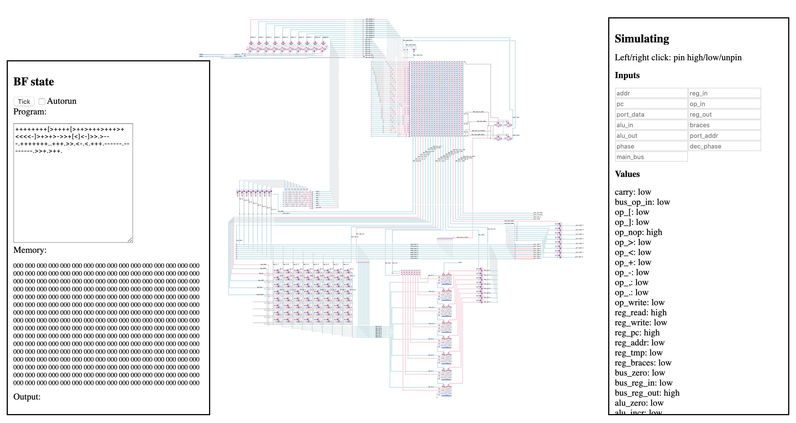

# A Brainfuck microprocessor for MiPSim

See it [live](https://castux.github.io/mipsim/bf-proc/)! It takes a while to load.

This is a not-too-serious project to design a microprocessor for the Brainfuck programming language, taken as an instruction set.

## Architecture

8 instructions:

- `>`
- `<`
- `+`
- `-`
- `.`
- `,`
- `[`
- `]`

Ports:

- 8 bits address port
- 8 bits data port

Memories (not part of the microprocessor):

- 256 bytes of program
- 256 bytes of data

Registers:

- `pc` (address in program bank)
- `op` (current program instruction)
- `addr` (address of the current memory cell)
- `tmp` (used for some operations)
- `braces` (matching braces counter while jumping)

## Components

- Registers: read/writeable 8 bit numbers to hold the few important things we need to run the show
- ALU: "arithmetic logic unit". Here, it only knows how to increment or decrement. It has a buffer on the outside to allow reading and writing to the same register.
- IO port: connected to the outside world (the program bank and the memory bank)
- Clock: from a single alternating input clock pin, counts 10 phases. All operations happen on specific phases.
- Operation decoder: it stores the current operation from the program, decodes it (byte to single wire), and feeds it into the instruction selector, a big ROM that combines current op and current phase to indicate what state should be all switches in the processor. There is a special `reset` op for initialization.
- Seek mode flags, used for the jump instructions: seek forward, seek backward. When encountering a `[`, we set the `braces` register to 1 and move forward, increasing/decreasing it when encountering other braces, until the count goes to zero, which means we found the matching brace. After this, operation returns to normal. Same for `]` but backwards.

Routing is done via a main 8 bits bus, that links registers, ALU, IO and op decoder. All these accesses are switchable by the operation decoder.

The ALU is always connected to the output of the registers.

## Switches at the output of op decoder

Main bus routing:

- data/address port
- ALU out
- registers out
- registers in
- op in

IO port:

- read/write
- memory selector
- program selector
- io selector

Registers:

- pc / addr / mem / braces
- read / write

ALU:

- increment/decrement
- write to own output buffer

op decoder:

- write op

seek mode:

- set seek forward
- set seek backward
- main bus is zero
- main bus is non-zero

By switching all these at the right moment depending on op and phase, we get a working processor! Some operations are common to all opcodes. For instance, every clock cycle begins by reading the op from the program bank, and every cycle ends by increasing `pc`. What happens in between is op-dependent.

## Host

The processor is hosted by a Lua program that sets it up:

1. `clock` pin low
2. `reset` pin high
3. `reset` pin low

Simulation then proceeds by repeating clock cycles as follows:

1. toggle `clock` pin
2. handle IO

After each clock tick, the host checks if one of the three IO selectors is high (memory, program or IO), reads the address if needed, the write flag, and either read the selected bank at the given address (puts the value on the data port by pulling the bits high/low), or writes the current value of the data port to memory.

There is no ending condition, the program has to be interrupted externally.

Note that when running in the web editor, input always returns the byte for the letter "a".

## Standalone simulator

- Requirements: Lua 5.3
- Usage: `lua main.lua program.bf`

## It works! Kinda :(

The simulator works pretty well! At least for the non-loop instructions. Looping is somewhat broken. And the basic instructions actually sometimes randomly fail as well.

### Timing

Logic gates and similar components are "pure" logic functions: even if all their inputs flicker between high and low, they will eventually settle and the outputs will be correct.

This is not true of memory cells, which in this simulation are mostly nor-based [gated d-latches](https://en.wikipedia.org/wiki/Flip-flop_(electronics)#Gated_D_latch).

If the inputs flicker while the gate is high, the final value saved in the component might be wrong. To ensure proper data consistency, you'd need to set up all inputs, set the gate high, then set the gate low to isolate the memory cell, and then move on to the next instruction.

This simulation propagates values in a breadth-first manner, meaning that some transistors might update "at the same time", which really means in a random order (depending on the Lua VM and table indexing, etc.) If the final value of a wire which is fed into a memory cell depends on the random opening and closing of transistors, we have a race condition and the processor's operation will be non-deterministic.

### Architecture

As this was developed at the same time as the simulator, not a lot of thought went into planning. In the end we have unused registers, redundant switches, etc. This could be made a lot simpler and cleaner.

## Version 2

Version 1 was great for learning what not to do. A version 2 could wrap things up in a working demo :D

Timing could be fixed using a strict timing rule. All memory cells should be gated using the main clock: writes should happen only on high clock, and then the gate closes on low clock *while every other switch stays untouched*. Each phase in the operation decoder would therefore be a bunch of switches set on high clock, and as the clock goes low, *only* the write gates close, ensuring safe writes. On the next high clock, the next set of switches is set, etc.

Architecture could be simplified:

- Separate a data bus and an address bus. `pc` and `addr` only ever need to connect to the address port, while `op` only ever comes from the data port.
- Since address and data bus are separate, reading from memory can happen in a single phase.
- Only have a single `tmp` register at the exit of the ALU.
- Separate all registers and have separate flags for their bus-to-reg, reg-to-bus and write flags.
- ALU needs connections to both address and data busses.
- All incr/decr operations take just two phases: connect source to ALU while saving result in `tmp`. Then move `tmp` to source.
