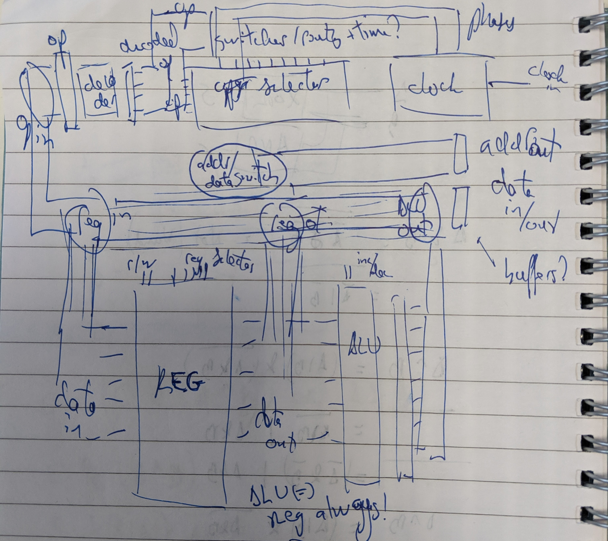

BF processor architecture
=========================

## General

8 instructions

- `>`
- `<`
- `+`
- `-`
- `.`
- `,`
- `[`
- `]`

(might ignore IO at first)

Busses:

- 8 bits address bus
- 8 bits data bus

Memories:

- 256 bytes of program
- 256 bytes of data

Registers:

- pc (address in program bank)
- op (current program instrution)
- address (current memory cell)
- mem (value of current memory cell)
- matching braces counter

Special:

- seek mode direction

## Processor cycles

Each processor cycle can comprise all these steps, and we'll ignore them for specific ops.

| OP | Read op | Read from memory or input | Incr/decr something | Write to memory or output | Incr/decr pc |
|:---|:--------|:--------------------------|:--------------------|:--------------------------|:-------------|
| >  | x       |                           | x                   |                           | x            |
| <  | x       |                           | x                   |                           | x            |
| +  | x       | x                         | x                   | x                         | x            |
| -  | x       | x                         | x                   | x                         | x            |
| .  | x       | x                         |                     | x                         | x            |
| ,  | x       | x                         |                     | x                         | x            |
| [  | x       |                           | x                   |                           | x            |
| ]  | x       |                           | x                   |                           | x            |

- Read op: pins to register
- Read from memory or input: pins to register
- Incr/decr: register back to same register
- Write to memory or output: register to pins
- Incr/decr pc: register back to same register

We only need to access one register at a time, so they can all be accessed via a selector and a single data bus inside the processor.

Except op, stored in the op decoder (since all the switching/routing/timing will depend on it).

Some of these operations might be done even if they are pointless, to reduce the complexity of the op decoder.

## Components

- Registers: read/writeable 8 bit numbers to hold the few important things we need to run the show
- ALU: "arithmetic logic unit". Here, it only knows how to increment or decrement. It has a buffer on the outside to allow reading and writing to the same register.
- IO port: connected to the outside world (the program bank and the memory bank)
- Clock: from a single alternating input clock pin, counts 5 (?) phases, each with an up and down subphase. All operations happen on specific phases.
- Operation decoder: it stores the current operation from the program, decodes it (byte to single wire), and feeds it into the big instruction selector, a big ROM that combines current op and current phase to indicate what state should be all switches in the processor

Routing is done via a main 8 bits bus, that links registers, ALU, IO and op decoder. All these accesses are switchable. Operations should always switch on two accesses: one that is read, and one that is written to.

The ALU is always connected to the output of the registers (no point in having an extra switch).  

## Switches at the output of op decoder

Main bus routing:

- data/address port
- ALU out
- registers out
- registers in
- op in

IO port:

- read/write
- memory/program bank (/later IO?)

Registers:

- pc / addr / mem / braces
- read / write

ALU:

- increment/decrement
- write/hold in own output buffer

op decoder:

- write op
- write seek mode and direction (as input to op decoder) (probably special routing)

~17 switches so far, all as outputs of the op decoder, will be switched on and off according to op and phase.
